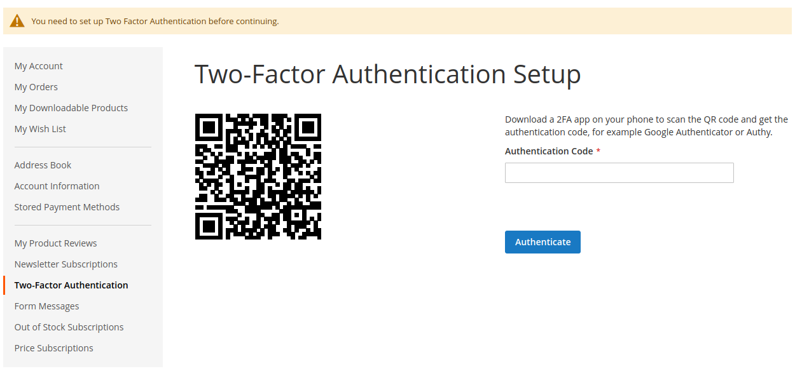
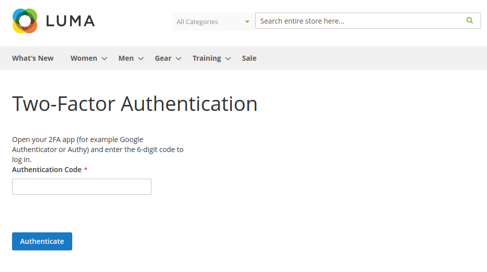
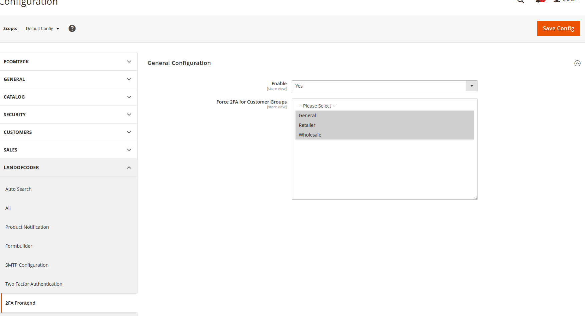

# Lof_Frontend2FA

This extension is based on [Lof_Authenticator](https://github.com/landofcoder/module-2-factor-authentication/), which offers 2FA for the backend.

## Features
- Ability to force frontend 2FA for specific customer groups;
- 2FA is enforced for chosen customer groups meaning the customer has to either setup or authenticate before continuing after logging in;
- All customers in any group can optionally set their own 2FA;
- Open the customer in the backend to be able to reset the 2FA secret;
- Dutch translation files.

## Installation

```
composer require landofcoder/module-frontend-2fa
php bin/magento module:enable Lof_Frontend2FA
php bin/magento module:enable Lof_Authenticator
php bin/magento setup:upgrade
```

## Integration with other authentication systems

To bypass the 2FA requirement for a specific logged in user, for example if you are using a Single Sign-On system for certain users,
set this value in their customer session:


```
$customerSession->set2faSuccessful(true);
```

## Screenshots

Setup page (in My Account)



2FA authentication after logging in when setup is done



Configuration in backend



2FA reset button in backend


## Authors

Landofcoder

## Donation

If this project help you reduce time to develop, you can give me a cup of coffee :) 

[](https://www.paypal.com/paypalme/allorderdesk)


**Our Magento 2 Extensions List**
* [Megamenu for Magento 2](https://landofcoder.com/magento-2-mega-menu-pro.html/)

* [Page Builder for Magento 2](https://landofcoder.com/magento-2-page-builder.html/)

* [Magento 2 Marketplace - Multi Vendor Extension](https://landofcoder.com/magento-2-marketplace-extension.html/)

* [Magento 2 Multi Vendor Mobile App Builder](https://landofcoder.com/magento-2-multi-vendor-mobile-app.html/)

* [Magento 2 Form Builder](https://landofcoder.com/magento-2-form-builder.html/)

* [Magento 2 Reward Points](https://landofcoder.com/magento-2-reward-points.html/)

* [Magento 2 Flash Sales - Private Sales](https://landofcoder.com/magento-2-flash-sale.html)

* [Magento 2 B2B Packages](https://landofcoder.com/magento-2-b2b-extension-package.html)

* [Magento 2 One Step Checkout](https://landofcoder.com/magento-2-one-step-checkout.html/)

* [Magento 2 Customer Membership](https://landofcoder.com/magento-2-membership-extension.html/)

* [Magento 2 Checkout Success Page](https://landofcoder.com/magento-2-checkout-success-page.html/)


**Featured Magento Services**

* [Customization Service](https://landofcoder.com/magento-2-create-online-store/)

* [Magento 2 Support Ticket Service](https://landofcoder.com/magento-support-ticket.html/)

* [Magento 2 Multi Vendor Development](https://landofcoder.com/magento-2-create-marketplace/)

* [Magento Website Maintenance Service](https://landofcoder.com/magento-2-customization-service/)

* [Magento Professional Installation Service](https://landofcoder.com/magento-2-installation-service.html)

* [Customization Service](https://landofcoder.com/magento-customization-service.html)


## License

This project is licensed under the MIT License


